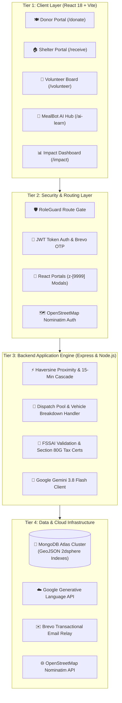
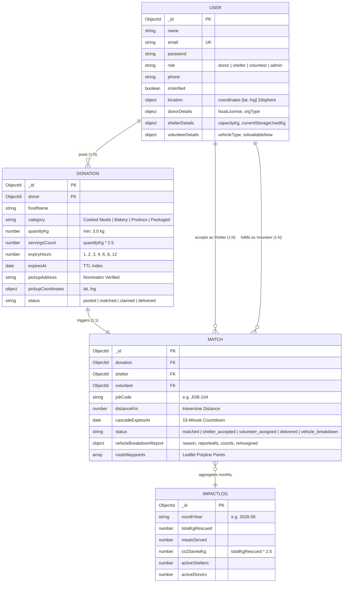
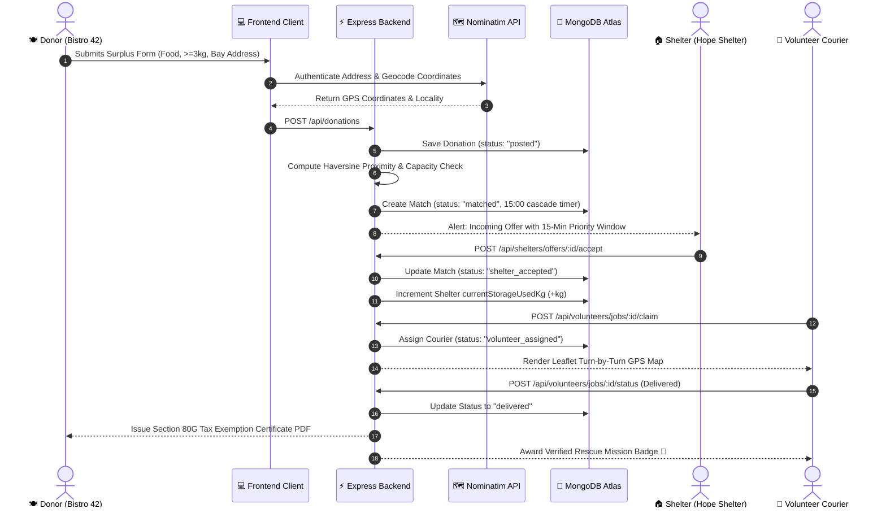

# 🌉 MealBridge — Real-Time Surplus Food Rescue & Shelter Redistribution Platform

> **AmiHacks 1.0 Submission — Track A: Surplus-to-Shelter**  
> *Connecting commercial kitchens and restaurants directly to verified local shelters with 15-minute smart cascading, real-time cold-chain capacity tracking, fault-tolerant volunteer routing, automated Section 80G tax deductions, and Gemini 3.8 Flash AI food safety intelligence.*

---

[](https://github.com/ShailjaSharma23/MealBridge)
[](https://github.com/ShailjaSharma23/MealBridge)
[](https://www.mongodb.com/atlas)
[](https://ai.google.dev/)
[](LICENSE)

---

## 📑 Table of Contents
1. [Executive Summary & Problem Statement](#-1-executive-summary--problem-statement)
2. [Key Innovations & Technical Highlights](#-2-key-innovations--technical-highlights)
3. [System Architecture Diagram](#-3-system-architecture-diagram)
4. [Database Schema & Entity Relationship Diagram](#-4-database-schema--entity-relationship-diagram)
5. [End-to-End Operational Lifecycle Flows](#-5-end-to-end-operational-lifecycle-flows)
6. [Core Technical Modules](#-6-core-technical-modules)
7. [Tech Stack Matrix](#-7-tech-stack-matrix)
8. [API Reference](#-8-api-reference)
9. [Quickstart & Local Installation](#-9-quickstart--local-installation)
10. [Viva / Examiner Cheatsheet & Documentation](#-10-viva--examiner-cheatsheet--documentation)
11. [Team & Credits](#-11-team--credits)

---

## 🌟 1. Executive Summary & Problem Statement

Every evening in major urban centers, hundreds of kilograms of wholesome, freshly prepared food from banquet halls, catering companies, and restaurants are sent to landfills. Meanwhile, nearby shelters and community homes face persistent nutritional deficits.

### The 4 Core Bottlenecks Solved by MealBridge:
1. **The Time-Decay Perishability Trap:** Cooked food has a statutory 2-to-4 hour safety window (FSSAI). Without automated real-time dispatch, meals spoil before couriers can be mobilized.
2. **Cold-Chain Capacity Mismatches:** Shelters often receive bulk donations that exceed their refrigerator capacities, leading to secondary spoilage.
3. **Logistics & Volunteer Malfunctions:** Donors lack dispatch transport, and courier breakdowns frequently stall active rescues.
4. **Donor Economic Disincentives:** Restaurants view food recovery as an added cost. MealBridge automates **Section 80G tax deductions**, turning surplus into tangible corporate tax relief.

---

## 💡 2. Key Innovations & Technical Highlights

- **🔒 Zero-Trust Role Confidentiality:** Enforces strict role isolation via `RoleGuard` and dynamic navbar scoping. Donors cannot see or tamper with shelter intake, shelters cannot view donor forms, and volunteers only see verified dispatch routes.
- **📍 Two-Tier Location Authentication:** Integrated **OpenStreetMap Nominatim Geocoding** alongside **Device GPS Authentication**. Bogus/gibberish addresses (e.g., `"abc nagar, xyz road"`) are blocked with unauthenticated location warnings.
- **⚖️ Logistical Feasibility Threshold (3 kg minimum):** Enforces a minimum batch size of 3 kg (~8–10 meals) for courier dispatch to ensure volunteer route efficiency and positive net carbon offsets.
- **⏱️ Synchronized Calibrated Expiry Slider:** Re-engineered discrete slider stops (`[1h, 2h, 3h, 4h, 6h, 8h, 12+h]`) ensuring 100% mathematical and visual alignment with food freshness labels.
- **⚡ 15-Minute Smart Cascade Algorithm:** Employs the Haversine distance formula and live cold-storage capacity checks. Offers forward automatically to the next nearest shelter if unaccepted within 15 minutes.
- **🛵 Volunteer Vehicle Malfunction Recovery Protocol:** Couriers can report breakdowns with one tap; the system removes the assignment with **zero penalty** and re-queues the mission at the top of the priority pool.
- **📜 Section 80G & ESG Impact Certification:** Automates 50% tax deduction certificates for donors and logs carbon offset metrics ($1\text{ kg food} = 2.5\text{ kg } CO_2e\text{ prevented}$).
- **🤖 MealBot AI (Google Gemini 3.8 Flash + Web Speech API):** Real-time conversational intelligence trained on FSSAI (2019) regulations with built-in voice speech narration.
- **🚪 React Portal Architecture:** Modals mount directly to `document.body` with `z-[9999]`, eliminating DOM stacking context clipping and banner overlap.

---

## 🏛️ 3. System Architecture Diagram



> **Detailed Architecture Document & Vector SVG:**  
> 📄 [docs/ARCHITECTURE.md](docs/ARCHITECTURE.md) | 🖼️ [docs/architecture-diagram.svg](docs/architecture-diagram.svg)

---

## 🍃 4. Database Schema & Entity Relationship Diagram



> **Detailed Database Documentation & Vector ERD:**  
> 📄 [docs/DATABASE_AND_FLOW.md](docs/DATABASE_AND_FLOW.md) | 🖼️ [docs/database-er-diagram.svg](docs/database-er-diagram.svg)

---

## 🔄 5. End-to-End Operational Lifecycle Flows

### 5.1 Surplus Rescue Sequence Flow


---

## 📦 6. Core Technical Modules

### 1. 🍽️ Donor Portal (`/donate`)
- **30-Second Fast Intake:** Dish title, food category, quantity (validated $\ge 3\text{ kg}$), and calibrated expiry slider.
- **Live 4-Stage Pipeline:** Visual tracking stepper:
  $$\text{Posted} \longrightarrow \text{Matched with Hope Shelter} \longrightarrow \text{Volunteer Assigned} \longrightarrow \text{Delivered}$$
- **Automated ESG & 80G Tax Exemption:** Generates downloadable corporate tax receipts and sustainability certificates.

### 2. 🏠 Shelter / NGO Portal (`/receive`)
- **Cold Storage Capacity Meter:** Real-time capacity bar (`35kg / 50kg Used - 70%`) preventing cold-chain food spoilage.
- **Dietary Preference Tags:** Multi-select intake criteria (`Veg Only`, `Cooked Meals Accepted`).
- **15-Minute Smart Cascade Algorithm:** Automatically forwards offers if unaccepted within 15 minutes, rearranging cards dynamically.

### 3. 🛵 Volunteer Rescue Board (`/volunteer`)
- **Job Category Filters:** Filter by `All Available (6)`, `Near Me (<3km)`, and `Urgent (<90 mins) ⚡`.
- **Interactive Route Map (Leaflet.js):** Custom CartoDB Positron maps rendering pickup donor (`Bistro 42`), dropoff shelter (`Hope Shelter`), and polyline navigation.
- **Emergency Breakdown Handler:** Single-tap malfunction reporting with zero penalty, immediately returning the job to the top of the pool.

### 4. 🤖 MealBot AI Learning Hub (`/ai-learn`)
- **Google Gemini 3.8 Flash Integration:** Real-time advice on FSSAI surplus food regulations, food holding temperatures, and 80G tax rules.
- **Web Speech API Voice Narration:** Click **"Voice Read 🔊"** to hear answers spoken aloud in clear audio.
- **Interactive Expiry Risk Calculator:** Evaluates microbiological decay based on food type and hours cooked.

### 5. 📊 Real-Time Impact Dashboard (`/impact`)
- **Aggregated City Counters:** 16,800+ kg food rescued, 38,400+ meals delivered, 42,000+ kg CO2e saved.
- **Visual Analytics (Recharts):** Growth area charts, surplus category donut charts, and public audit ledgers.

---

## 🛠️ 7. Tech Stack Matrix

| Layer | Technologies Used |
| :--- | :--- |
| **Frontend Framework** | React 18, Vite 6, React Router DOM 6 |
| **Styling & UI** | Tailwind CSS 3, Lucide React Icons, Canvas Confetti |
| **Maps & Routing** | Leaflet.js, CartoDB Positron Vector Tiles |
| **Voice & Speech** | Native Browser Web Speech API (`SpeechSynthesis`) |
| **Data Visualization** | Recharts (Area, Donut, Bar Charts) |
| **Backend Runtime** | Node.js (ES Modules), Express.js |
| **Database** | MongoDB Atlas, Mongoose ODM (`2dsphere` GeoJSON Indexing) |
| **Authentication** | JWT (JSON Web Tokens), Bcrypt.js, Brevo Transactional Email OTP |
| **Location Services** | OpenStreetMap Nominatim Geocoding API |
| **Artificial Intelligence** | Google Gemini 3.8 Flash API (`@google/generative-ai`) |
| **Deployment** | Render Web Services (Frontend & Backend Auto-Deploy) |

---

## 🔌 8. API Reference

### Authentication & Users
| Method | Endpoint | Description |
| :--- | :--- | :--- |
| `POST` | `/api/users/register` | Register new Donor, Shelter, or Volunteer with role-specific verification fields |
| `POST` | `/api/users/login` | Authenticate with email and password |
| `POST` | `/api/users/send-otp` | Dispatch 6-digit Brevo OTP (fallback: `123456`) |
| `POST` | `/api/users/verify-otp` | Verify OTP and issue JWT session token |
| `PUT` | `/api/users/profile` | Update profile, location coordinates, and capacity |

### Donations & Logistics
| Method | Endpoint | Description |
| :--- | :--- | :--- |
| `POST` | `/api/donations` | Create surplus food donation (enforces $\ge 3\text{ kg}$ and geocoded location) |
| `GET` | `/api/donations/active-pipeline` | Fetch live 4-stage tracking status |
| `GET` | `/api/donations/certificate` | Generate Section 80G tax exemption certificate |
| `GET` | `/api/shelters/offers` | Fetch incoming matched offers within proximity |
| `POST` | `/api/shelters/offers/:id/accept` | Accept donation and update cold storage capacity |
| `GET` | `/api/volunteers/jobs` | Fetch available rescue mission pool |
| `POST` | `/api/volunteers/jobs/:id/claim` | Volunteer claims rescue mission |
| `POST` | `/api/volunteers/jobs/:id/breakdown` | Report vehicle malfunction & trigger emergency re-queue |

### AI & Intelligence
| Method | Endpoint | Description |
| :--- | :--- | :--- |
| `POST` | `/api/ai/mealbot` | Conversational FSSAI and legal advice via Google Gemini 3.8 Flash |
| `POST` | `/api/ai/calculate-expiry` | Calculate microbiological safety score and shelf-life |

---

## 🚀 9. Quickstart & Local Installation

### Prerequisites
- Node.js (v18 or higher)
- Active MongoDB connection (Local or MongoDB Atlas URI)

### 1. Clone & Install
```bash
git clone https://github.com/ShailjaSharma23/MealBridge.git
cd MealBridge

# Install backend dependencies
cd backend && npm install

# Install frontend dependencies
cd ../frontend && npm install
cd ..
```

### 2. Configure Environment Variables
Create `backend/.env`:
```env
PORT=5000
NODE_ENV=development
MONGODB_URI=mongodb+srv://<user>:<password>@cluster0.c7bb0ee.mongodb.net/mealbridge?retryWrites=true&w=majority
JWT_SECRET=mealbridge_super_secure_jwt_secret_2026
GEMINI_API_KEY=your_gemini_api_key_here
CLIENT_URL=http://localhost:5173
```

### 3. Seed Realistic Atlas Data
From `backend/`:
```bash
node utils/seeder.js
```
*Seeds 11 verified users, 6 surplus donations, active Job `#JOB-104`, and June 2026 impact logs.*

### 4. Run Locally
```bash
# Terminal 1: Backend Server (Port 5000)
cd backend && npm start

# Terminal 2: Frontend App (Port 5173)
cd frontend && npm run dev
```
- **Web App:** `http://localhost:5173/`
- **Backend API:** `http://localhost:5000/api`

---

## 🎓 10. Viva / Examiner Cheatsheet & Documentation

We have prepared comprehensive presentation documents for the examination panel:

- 📋 **[Viva Cheat Sheet & Top 10 Questions](docs/VIVA_CHEAT_SHEET.md)** — Complete script with answers on algorithms, FSSAI law, 80G tax rules, and breakdown handling.
- 🏛️ **[Detailed Architecture Specification](docs/ARCHITECTURE.md)** — In-depth architectural analysis and mathematical formulas.
- 🗄️ **[Database Schemas & Data Flow Guide](docs/DATABASE_AND_FLOW.md)** — Full collection specifications, indexes, and state diagrams.
- 🖼️ **[Vector Architecture Diagram (SVG)](docs/architecture-diagram.svg)** — High-res visual diagram for presentations.
- 🖼️ **[Vector Database ER Diagram (SVG)](docs/database-er-diagram.svg)** — High-res entity-relationship diagram.

---

## 👥 11. Team & Credits

- **Yash Bhatt** — Full-Stack Architecture, Real-Time Routing, Geospatial Dispatch, Database Design & Viva Lead.
- **Shailja Sharma** — UI/UX Design, Regulatory Compliance, AI Integration & Impact Metrics.
- **Bhumika Sharma** — Interface Design, User Experience, Design Systems & Accessibility.
- **Naitik Tiwari** — Technology Research, Solution Validation, Technical Feasibility & Innovation Strategy.

*Developed with pride for **AmiHacks 1.0 (Track A: Surplus-to-Shelter)**.*