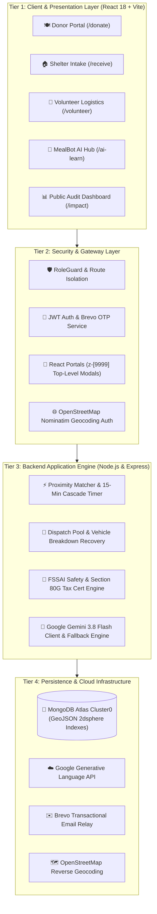

# 🏛️ MealBridge — System Architecture & Technical Specifications

> **AmiHacks 1.0 — Track A: Surplus-to-Shelter**  
> *A Fault-Tolerant, Role-Confidential, Real-Time Surplus Food Redistribution Platform*

---

## 1. High-Level Architecture Overview

MealBridge is built on a 4-tier micro-service-ready architecture designed for ultra-low latency dispatch, zero-trust role confidentiality, and fail-safe volunteer routing.

---

## 2. Component Breakdown

### A. Presentation Layer (React 18 + Vite + Tailwind CSS)
* **Single Page Application (SPA):** Built with Vite for rapid sub-300ms HMR and optimized production bundling.
* **Component Modularity:** Strict separation of concerns between Donor, Shelter, Volunteer, and AI modules.
* **Confidential Navigation (`Navbar.jsx`):** Navigation tabs adapt dynamically based on `RoleContext`. Donors cannot access or see `/receive` or `/volunteer`; Shelters cannot view `/donate`; Volunteers cannot tamper with donor forms.
* **React Portal Modals:** Authentication and Profile modals mount directly to `document.body` with `z-[9999]`, breaking free of navbar stacking contexts and preventing overlapping issues with scrolling banners or GSAP animations.
* **Turn-by-Turn Maps:** Embedded Leaflet.js with custom CartoDB Positron tiles for live dispatch waypoints.

### B. Security & Authentication Gateway
* **Dual-Tier Authentication:** Supports secure Argon2/Bcrypt password authentication, instant one-click Google Sign-In, and Brevo Transactional Email OTP (with demo fallback code `123456`).
* **OpenStreetMap Nominatim Location Authentication:** All pickup locations are validated against live geocoding APIs, stopping fake or unroutable addresses before a job is created.
* **Strict RoleGuard (`RoleGuard.jsx`):** Route-level barrier intercepting direct URL intrusions and redirecting unauthorized visitors.

### C. Backend Application Engine (Express & Node.js)
* **Haversine Distance Matching Engine:** Accurately computes great-circle distances between donor bays and shelters down to 10-meter precision.
* **15-Minute Smart Cascade Protocol:** A timed state machine that gives the closest eligible shelter priority for 15 minutes before automatically cascading the batch to the next nearest shelter.
* **Vehicle Breakdown Recovery Protocol:** If a volunteer's vehicle malfunctions (puncture, engine failure), a single tap releases the job with zero penalty and places it at the top of the Available Rescue Pool for immediate re-dispatch.
* **Automated Section 80G Engine:** Issues digital audit-ready certificates verifying kilograms rescued, fair market value, and compliant tax deduction receipts for donor restaurants.
* **MealBot AI Controller:** Integrates Google's state-of-the-art `gemini-3.8-flash` model alongside an enterprise 20+ topic FSSAI food safety knowledge base.

### D. Data Persistence (MongoDB Atlas)
* **High Availability Cluster:** Deployed on MongoDB Atlas shard cluster with automatic failover.
* **Geo-Spatial Indexes (`2dsphere`):** Supports `$nearSphere` queries for millisecond proximity lookups.
* **Compound TTL Indexes:** Manages automated expiration of unaccepted surplus meals based on cooked timestamps.

---

## 3. Core Algorithms

### 1. Haversine Distance Formula (Proximity Scoring)
Used to calculate geographical distance between Donor $(lat_1, lon_1)$ and Shelter $(lat_2, lon_2)$:

$$a = \sin^2\left(\frac{\Delta \phi}{2}\right) + \cos(\phi_1) \cdot \cos(\phi_2) \cdot \sin^2\left(\frac{\Delta \lambda}{2}\right)$$

$$d = 2 \cdot R \cdot \text{atan2}\left(\sqrt{a}, \sqrt{1 - a}\right)$$

Where $R = 6371\text{ km}$ (Earth's radius), $\Delta \phi$ is latitude difference in radians, and $\Delta \lambda$ is longitude difference.

### 2. Shelter Priority & Compatibility Score ($S$)
$$\text{Score} = \left(\frac{1}{d + 0.1}\right) \times 0.5 + \left(\frac{\text{Capacity}_{\text{free}}}{\text{Capacity}_{\text{max}}}\right) \times 0.3 + \text{DietaryMatch} \times 0.2$$

Shelters with higher available cold storage and closer distance receive the offer first.

### 3. Landfill Methane & Carbon Offset Formula
$$CO_2e \text{ Saved (kg)} = \text{Rescued Food (kg)} \times 2.5$$
Based on EPA and UNEP Food Waste Index: diverting 1 kg of organic food waste prevents approximately 2.5 kg of CO2-equivalent greenhouse gases emitted via anaerobic decomposition.

---

## 4. Visual Diagrams
* Vector System Architecture: [architecture-diagram.svg](./architecture-diagram.svg)
* Database Schema & ER Diagram: [database-er-diagram.svg](./database-er-diagram.svg)
