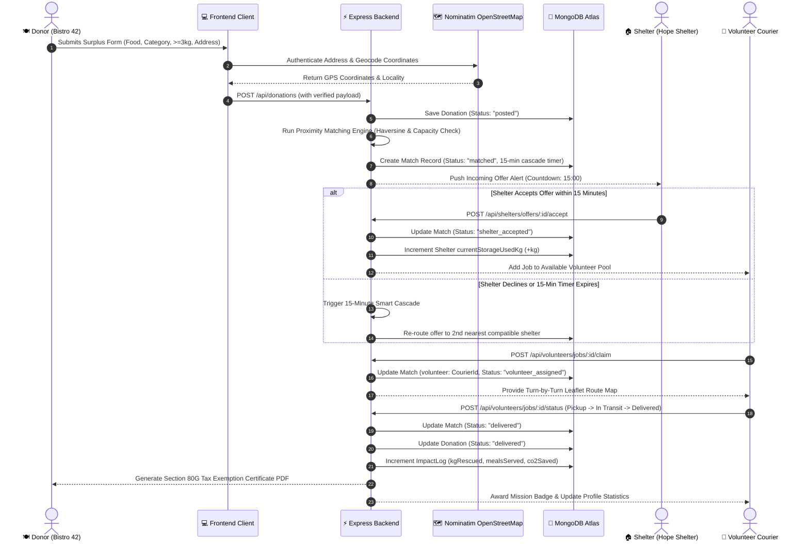
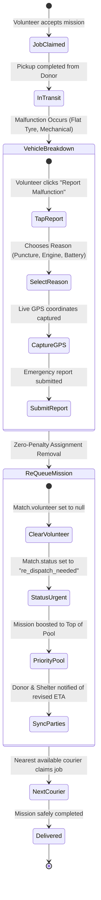
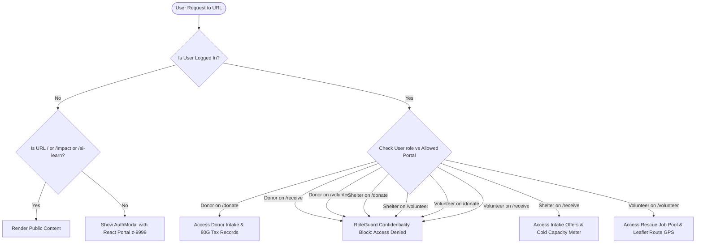

# 🗄️ MealBridge — Database Architecture & End-to-End System Flows

> **Database Engine:** MongoDB Atlas (Mongoose ODM)  
> **Geospatial Indexing:** `2dsphere` on `location.coordinates`  
> **Cluster Environment:** `ac-knketf4-shard-00-01.c7bb0ee.mongodb.net/mealbridge`

---

## 1. Database Collections & Schemas

### 1.1 `User` Model (`backend/models/User.js`)
Stores authenticated entities (Donors, Shelters, Volunteers, and Admins) with role-specific operational parameters:

| Field | Type | Description |
| :--- | :--- | :--- |
| `_id` | `ObjectId` | Primary key |
| `name` | `String` | Legal individual name or commercial business name |
| `email` | `String` | Unique, indexed login email address |
| `password` | `String` | Bcrypt salt-hashed password |
| `role` | `String` | Enum: `'donor'`, `'shelter'`, `'volunteer'`, `'admin'` |
| `phone` | `String` | Emergency dispatch contact number |
| `isVerified` | `Boolean` | FSSAI safety license and NGO NGO Darpan verification |
| `location.address` | `String` | Verified street address |
| `location.coordinates` | `{ lat: Number, lng: Number }` | GeoJSON coordinates (indexed for 2dsphere proximity) |
| `donorDetails` | `Object` | `{ organizationType, fssaiLicense, pickupBayNotes }` |
| `shelterDetails` | `Object` | `{ capacityKg, currentStorageUsedKg, foodPreferences, contactPerson }` |
| `volunteerDetails` | `Object` | `{ vehicleType, isAvailableNow, completedRescuesCount, totalKgDelivered }` |

---

### 1.2 `Donation` Model (`backend/models/Donation.js`)
Represents surplus batches posted by food donors:

| Field | Type | Validation / Description |
| :--- | :--- | :--- |
| `_id` | `ObjectId` | Primary key |
| `donor` | `ObjectId` | Foreign key referencing `User._id` |
| `donorName` | `String` | Cached establishment name (e.g. "Bistro 42") |
| `foodName` | `String` | Dish description (e.g. "Vegetable Curry & Steamed Rice") |
| `category` | `String` | Enum: `'Cooked Meals'`, `'Bakery'`, `'Produce'`, `'Packaged Food'` |
| `quantityKg` | `Number` | **Validated minimum: 3.0 kg** (courier dispatch feasibility) |
| `servingsCount` | `Number` | Automatically derived: `Math.round(quantityKg * 2.5)` meals |
| `dietaryType` | `String` | Enum: `'Veg Only'`, `'Non-Veg'`, `'Vegan'`, `'Jain Friendly'` |
| `expiryHours` | `Number` | Calibrated preservation window (1, 2, 3, 4, 6, 8, 12 hrs) |
| `expiresAt` | `Date` | Timestamp computed from creation time + expiryHours |
| `pickupAddress` | `String` | OpenStreetMap Nominatim authenticated address string |
| `pickupCoordinates` | `{ lat: Number, lng: Number }` | Precise GPS dispatch coordinates |
| `status` | `String` | `'posted'`, `'matched'`, `'claimed'`, `'delivered'`, `'expired'` |
| `taxReceiptGenerated` | `Boolean` | Flag indicating if Section 80G tax receipt was issued |

---

### 1.3 `Match` Model (`backend/models/Match.js`)
Tracks the real-time fulfillment contract between a donation, an accepting shelter, and a volunteer courier:

| Field | Type | Description |
| :--- | :--- | :--- |
| `_id` | `ObjectId` | Primary key |
| `donation` | `ObjectId` | Foreign key referencing `Donation._id` |
| `shelter` | `ObjectId` | Foreign key referencing `User._id` (Shelter) |
| `volunteer` | `ObjectId` | Foreign key referencing `User._id` (Volunteer, optional until claimed) |
| `jobCode` | `String` | Human-readable dispatch code (e.g. `"JOB-104"`) |
| `distanceKm` | `Number` | Haversine calculated distance between bay and shelter |
| `estimatedMinutes` | `Number` | ETA based on average urban courier speed (20 km/h) |
| `cascadeExpiresAt` | `Date` | 15-minute countdown deadline for shelter acceptance |
| `cascadeCount` | `Number` | Number of times the offer has forwarded to next shelter |
| `status` | `String` | `'matched'`, `'shelter_accepted'`, `'volunteer_assigned'`, `'in_transit'`, `'delivered'`, `'vehicle_breakdown'` |
| `vehicleBreakdownReport` | `Object` | `{ isReported: Boolean, reason: String, notes: String, reportedAt: Date, breakdownCoordinates: Object, isReAssigned: Boolean }` |
| `routeWaypoints` | `Array` | Leaflet polyline points connecting pickup and drop-off |

---

### 1.4 `ImpactLog` Model (`backend/models/ImpactLog.js`)
Aggregated sustainability records used for public audits and ESG reporting:

| Field | Type | Description |
| :--- | :--- | :--- |
| `_id` | `ObjectId` | Primary key |
| `monthYear` | `String` | Reporting period (e.g. `"2026-06"`) |
| `totalKgRescued` | `Number` | Cumulative weight of food rescued (kg) |
| `mealsServed` | `Number` | Calculated nutritional portions delivered |
| `co2SavedKg` | `Number` | Calculated emissions prevented: `totalKgRescued * 2.5` |
| `activeShelters` | `Number` | Count of registered recipient shelters |
| `activeDonors` | `Number` | Count of participating food establishments |
| `categoryBreakdown` | `Object` | `{ cookedMealsKg, bakeryKg, produceKg, packagedKg }` |

---

## 2. End-to-End System Flow Diagrams

### 2.1 Complete Surplus Food Rescue Lifecycle



---

### 2.2 Volunteer Vehicle Breakdown & Emergency Recovery Protocol



---

### 2.3 Role Confidentiality & Gateway Barrier



---

## 3. Database Indexes for High-Throughput Performance

To ensure sub-50ms response times during live presentations:

```javascript
// 1. Geospatial indexing on User location
userSchema.index({ 'location.coordinates': '2dsphere' });

// 2. Proximity indexing on Donation pickup coordinates
donationSchema.index({ pickupCoordinates: '2dsphere' });

// 3. Time-to-Live (TTL) index on surplus meals
donationSchema.index({ expiresAt: 1 }, { expireAfterSeconds: 0 });

// 4. Compound index on active matches
matchSchema.index({ status: 1, shelter: 1 });
matchSchema.index({ status: 1, volunteer: 1 });
```
